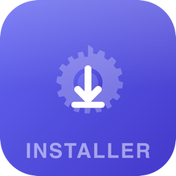

<p align="center">
  
</p>

<h1 align="center">OpenClaw Box</h1>

<p align="center">
  Install, configure, and manage your <a href="https://github.com/openclaw/openclaw">OpenClaw</a> AI agents — all from one desktop app.
</p>

<p align="center">
  
  
  
  
</p>

---

## ✨ Features

### 🤖 Agent Management Center
- View all agents at a glance with real-time status (working / idle / offline)
- Per-agent detail view with sub-tabs:
  - **💬 Chat** — Embedded conversation interface
  - **⏰ Cron Jobs** — View and trigger scheduled tasks
  - **🧠 Memory** — Browse and edit agent memory files
  - **📡 Channels** — View channel bindings (Telegram, Kim, etc.)
  - **📊 Usage** — Token usage stats with daily trends
  - **⚙️ Config** — Model switching and agent configuration
- Create new agents directly from the UI

### 🧩 Model Management
- View all configured providers and their models
- Add new LLM providers (DeepSeek, SiliconFlow, Zhipu, Qwen, OpenRouter, etc.)
- Test API connections before saving
- Switch agent models with one click

### 🔗 Channel Management
- View all connected channels with agent bindings
- Support for Telegram, Kim, Feishu, QQ, and more
- See which agents are bound to which channels

### 🖥️ One-Click Setup
- Auto-detect system environment (OS, Node.js, network)
- Download Node.js and install OpenClaw automatically
- China-optimized mirrors for npm and Node.js
- Configure LLM provider and messaging channel in a guided wizard

### 📊 Dashboard
- Gateway status and health monitoring
- Token usage and cost tracking
- Agent activity overview
- System health checks

### 🔧 Settings
- OpenClaw configuration editor
- Version update checker and installer
- Config backup and restore
- System health diagnostics

## 📦 Install

Download from [Releases](https://github.com/jiusanzhou/openclaw-box/releases):

| Platform | File |
|----------|------|
| macOS (Apple Silicon) | `_aarch64.dmg` |
| macOS (Intel) | `_x64.dmg` |
| Windows | `.exe` / `.msi` |
| Linux | `.deb` / `.AppImage` |

## 🚀 Quick Start

1. Open OpenClaw Box
2. Follow the setup wizard (environment check → provider config → channel setup → install)
3. Done! Manage your agents from the dashboard.

## 🛠️ Development

```bash
# Install dependencies
pnpm install

# Start dev environment
pnpm tauri dev

# Build for release
pnpm tauri build
```

### Prerequisites

- Node.js 18+
- Rust 1.70+
- pnpm

## 📐 Tech Stack

- [Tauri v2](https://v2.tauri.app/) — Desktop app framework
- [React 19](https://react.dev/) — Frontend
- [TypeScript](https://www.typescriptlang.org/) — Type safety
- [TailwindCSS](https://tailwindcss.com/) — Styling
- [Rust](https://www.rust-lang.org/) — Backend

## License

[MIT](LICENSE)
